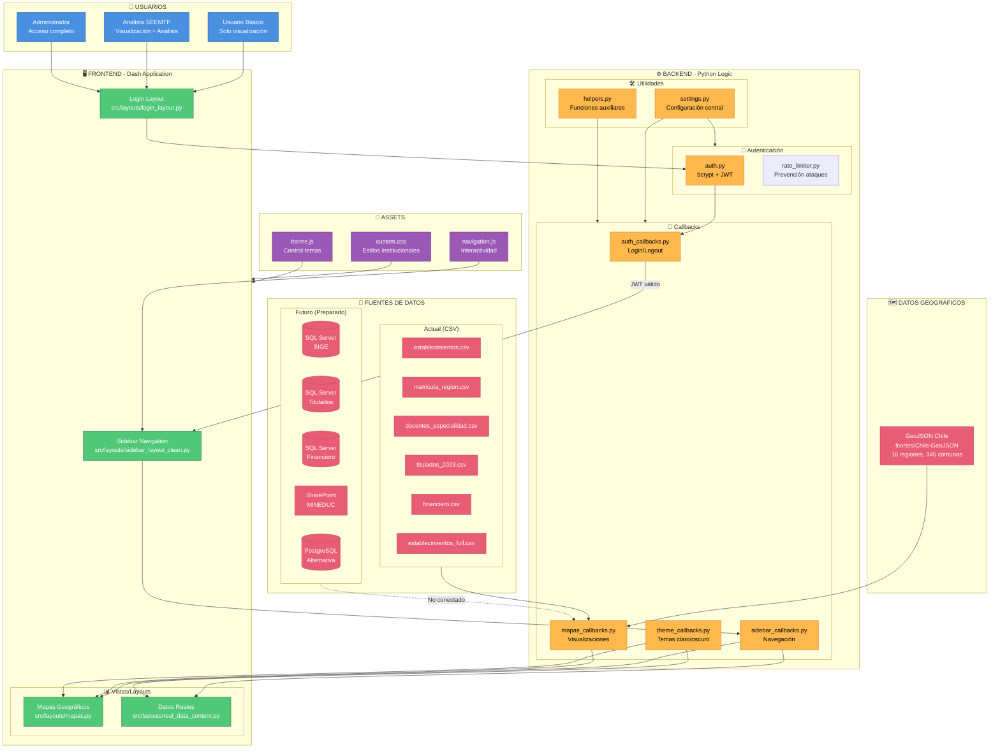
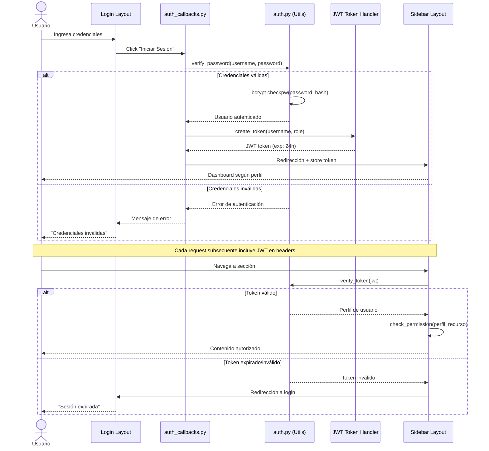
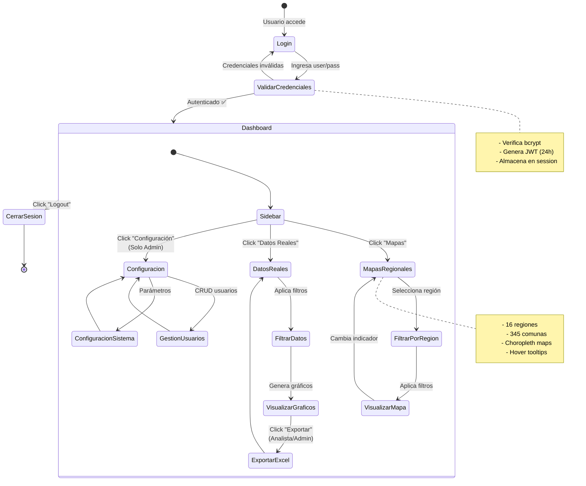

# Arquitectura Detallada - Visualizador EMTP Dash

**Fecha**: Noviembre 2024  
**Versión**: 2.0 (Python/Dash)  
**Estado**: Desarrollo/Demostración

---

## 1. Visión General del Sistema

El **Visualizador EMTP** es una aplicación web de dashboards interactivos para visualizar datos de Educación Media Técnico-Profesional en Chile. Construido con Python, Dash y Plotly, integra autenticación basada en roles, visualizaciones geográficas y consultas de datos.

### Características Principales
- ✅ **Autenticación**: Login con contraseñas hasheadas (bcrypt) y tokens JWT
- ✅ **Control de Acceso**: 3 perfiles de usuario (Usuario/Analista/Admin)
- ✅ **Visualización Geográfica**: Mapas coropléticos de Chile (16 regiones, 345 comunas)
- ✅ **Dashboards Interactivos**: Filtros dinámicos, gráficos responsivos
- ✅ **Datos Simulados**: 178,700 registros en 6 archivos CSV
- 🔜 **Conexión a Bases de Datos**: Preparado para SQL Server, PostgreSQL, SharePoint

---

## 2. Diagrama de Arquitectura General



---

## 3. Flujo de Autenticación y Autorización



### Perfiles de Usuario (USER_PROFILES en auth.py)

| Perfil | Visualización | Filtros Avanzados | Exportación | Configuración |
|--------|---------------|-------------------|-------------|---------------|
| **Usuario Básico** | ✅ Lectura | ❌ | ❌ | ❌ |
| **Analista SEEMTP** | ✅ Lectura | ✅ Filtros | ✅ Excel/PDF | ❌ |
| **Administrador** | ✅ Lectura | ✅ Filtros | ✅ Excel/PDF | ✅ Gestión usuarios |

---

## 4. Flujo de Datos - Visualizaciones Geográficas

```mermaid
flowchart LR
    subgraph Input["📥 ENTRADA"]
        User[Usuario selecciona:<br/>- Región<br/>- Indicador<br/>- Año]
    end

    subgraph Processing["⚙️ PROCESAMIENTO"]
        Callback[mapas_callbacks.py<br/>@callback actualizar_mapa]
        Filter[Aplicar filtros:<br/>WHERE region = X<br/>AND año = Y]
        Aggregate[Agrupar por comuna:<br/>SUM/AVG/COUNT]
        Merge[Merge con GeoJSON:<br/>por código comuna]
    end

    subgraph DataLayer["💾 CAPA DE DATOS"]
        CSV[(CSV Files<br/>matricula_region.csv<br/>establecimientos_full.csv)]
        GeoData[(GeoJSON<br/>comunas_chile.json<br/>345 polígonos)]
    end

    subgraph Visualization["📊 VISUALIZACIÓN"]
        Plotly[Plotly Choropleth Map<br/>go.Choroplethmapbox]
        ColorScale[Escala de colores:<br/>5 tonos institucionales<br/>#1C3F6E → #4A90E2]
        Interactive[Interactividad:<br/>- Hover: Datos detallados<br/>- Click: Drill-down<br/>- Zoom: Navegación]
    end

    subgraph Output["📤 SALIDA"]
        Map[Mapa Interactivo<br/>en dashboard]
    end

    User --> Callback
    Callback --> Filter
    Filter --> CSV
    Filter --> Aggregate
    Aggregate --> Merge
    Merge --> GeoData
    GeoData --> Plotly
    Plotly --> ColorScale
    ColorScale --> Interactive
    Interactive --> Map
    Map --> User

    classDef inputClass fill:#4A90E2,stroke:#2E5C8A,color:#fff
    classDef procClass fill:#FFB84D,stroke:#CC8A3D,color:#000
    classDef dataClass fill:#E85D75,stroke:#B84A5F,color:#fff
    classDef vizClass fill:#50C878,stroke:#2E7D52,color:#fff

    class User,Input inputClass
    class Callback,Filter,Aggregate,Merge procClass
    class CSV,GeoData dataClass
    class Plotly,ColorScale,Interactive,Map vizClass
```

---

## 5. Estructura de Archivos del Proyecto

```
VisualizadorEMTP-Dash/
│
├── app_v2.py                      # 🚀 ENTRY POINT - Inicialización Dash
│
├── config/                        # ⚙️ CONFIGURACIÓN
│   ├── __init__.py
│   ├── settings.py               # Variables de entorno, constantes
│   └── database.py               # (Futuro) Conexiones DB
│
├── src/                          # 📦 CÓDIGO FUENTE
│   ├── callbacks/                # 🔄 LÓGICA REACTIVA
│   │   ├── auth_callbacks.py     # Login/Logout
│   │   ├── sidebar_callbacks.py  # Navegación (733 líneas)
│   │   ├── mapas_callbacks.py    # Visualizaciones geográficas
│   │   └── theme_callbacks.py    # Tema claro/oscuro
│   │
│   ├── layouts/                  # 🖼️ INTERFACES
│   │   ├── login_layout.py       # Pantalla de login
│   │   ├── sidebar_layout_clean.py  # Navegación lateral
│   │   ├── mapas.py              # Layout mapas (449 líneas)
│   │   └── real_data_content.py  # Dashboard datos reales
│   │
│   └── utils/                    # 🛠️ UTILIDADES
│       ├── auth.py               # bcrypt + JWT (303 líneas)
│       ├── helpers.py            # Funciones auxiliares
│       └── rate_limiter.py       # Seguridad
│
├── data/                         # 💾 DATOS
│   ├── raw/                      # CSV originales (178,700 registros)
│   ├── processed/                # Datos transformados
│   └── geographic/               # GeoJSON de Chile
│
├── assets/                       # 🎨 ASSETS ESTÁTICOS
│   ├── custom.css                # Estilos institucionales
│   ├── navigation.js             # Lógica navegación
│   └── theme.js                  # Control temas
│
├── docs/                         # 📚 DOCUMENTACIÓN TÉCNICA (GitHub)
│   ├── ARQUITECTURA_DETALLADA.md # ← Este documento
│   ├── PROPUESTA_TECNICA_INTEGRAL.md
│   └── RESUMEN_EJECUTIVO.md
│
├── _docs-planificacion/          # 📋 DOCS PERSONALES (Local only)
│   ├── RESUMEN_EJECUTIVO_JEFATURA.md
│   ├── DEFINICIONES_PARA_PRODUCCION.md
│   └── ... (7 documentos estratégicos)
│
├── _archive/                     # 🗄️ ARCHIVOS OBSOLETOS (Local only)
│   ├── shiny-obsoleto/           # Versión R/Shiny antigua
│   └── docs-referencia/          # Documentos Word antiguos
│
├── requirements.txt              # 📦 Dependencias Python
├── Dockerfile                    # 🐳 Contenedor Docker
└── .gitignore                    # 🚫 Exclusiones Git
```

---

## 6. Stack Tecnológico

### Backend
- **Python**: 3.12+
- **Framework Web**: Dash 2.14.2 (sobre Flask)
- **Autenticación**: 
  - bcrypt 4.1.2 (hash de contraseñas)
  - PyJWT 2.8.0 (tokens JWT)
- **Datos**:
  - pandas 2.2.0 (manipulación de datos)
  - pyodbc 5.0.1 (SQL Server - futuro)
  - psycopg2-binary 2.9.9 (PostgreSQL - futuro)

### Frontend
- **UI Framework**: Dash Bootstrap Components 1.5.0
- **Visualizaciones**: Plotly 5.18.0
- **Estilos**: CSS personalizado + Bootstrap 5
- **JavaScript**: Vanilla JS para interactividad

### Datos Geográficos
- **Fuente**: [fcortes/Chile-GeoJSON](https://github.com/fcortes/Chile-GeoJSON)
- **Formato**: GeoJSON con 345 polígonos (comunas)
- **Proyección**: WGS84 (EPSG:4326)

### Infraestructura
- **Servidor de Desarrollo**: Dash built-in (puerto 8051)
- **Producción (preparado)**: Gunicorn + Nginx
- **Contenedores**: Docker + Docker Compose

---

## 7. Flujo de Navegación del Usuario



---

## 8. Preparación para Producción

### 8.1 Conexiones a Bases de Datos (Código preparado en `config/database.py`)

```python
# SQL Server Connection (SIGE, Titulados, Financiero)
def get_sqlserver_connection():
    conn = pyodbc.connect(
        f'DRIVER={{ODBC Driver 17 for SQL Server}};'
        f'SERVER={os.getenv("SQL_SERVER")};'
        f'DATABASE={os.getenv("SQL_DATABASE")};'
        f'UID={os.getenv("SQL_USER")};'
        f'PWD={os.getenv("SQL_PASSWORD")}'
    )
    return conn

# PostgreSQL Connection (alternativa)
def get_postgres_connection():
    conn = psycopg2.connect(
        host=os.getenv("PG_HOST"),
        database=os.getenv("PG_DATABASE"),
        user=os.getenv("PG_USER"),
        password=os.getenv("PG_PASSWORD")
    )
    return conn
```

**Estado actual**: Funciones definidas, no llamadas. CSV usados para demo.

### 8.2 Variables de Entorno (`.env` - no incluido en Git)

```bash
# Autenticación
JWT_SECRET_KEY=your-super-secret-key-change-in-production
JWT_EXPIRATION_HOURS=24

# SQL Server
SQL_SERVER=sql-server.mineduc.cl
SQL_DATABASE=SIGE_EMTP
SQL_USER=app_visualizador
SQL_PASSWORD=secure_password_here

# PostgreSQL (alternativa)
PG_HOST=postgres.mineduc.cl
PG_DATABASE=emtp_data
PG_USER=app_user
PG_PASSWORD=another_secure_password

# SharePoint (futuro)
SHAREPOINT_SITE=https://mineduc.sharepoint.com/sites/EMTP
SHAREPOINT_CLIENT_ID=your_client_id
SHAREPOINT_CLIENT_SECRET=your_client_secret

# Configuración
DEBUG=False
LOG_LEVEL=INFO
PORT=8051
```

### 8.3 Despliegue con Docker

```dockerfile
# Dockerfile (ya existe en el proyecto)
FROM python:3.12-slim

WORKDIR /app

COPY requirements.txt .
RUN pip install --no-cache-dir -r requirements.txt

COPY . .

EXPOSE 8051

CMD ["gunicorn", "-b", "0.0.0.0:8051", "app_v2:server"]
```

```yaml
# docker-compose.yml (ya existe)
version: '3.8'
services:
  visualizador:
    build: .
    ports:
      - "8051:8051"
    environment:
      - JWT_SECRET_KEY=${JWT_SECRET_KEY}
      - SQL_SERVER=${SQL_SERVER}
      # ... resto de variables
    volumes:
      - ./data:/app/data
      - ./logs:/app/logs
```

---

## 9. Volumen de Datos (Estado Actual)

| Archivo | Registros | Columnas | Tamaño | Descripción |
|---------|-----------|----------|--------|-------------|
| **establecimientos.csv** | 1,124 | 10 | ~150 KB | Establecimientos EMTP |
| **matricula_region.csv** | 144 | 18 | ~25 KB | Matrícula por región/año |
| **docentes_especialidad.csv** | 960 | 5 | ~40 KB | Docentes por especialidad |
| **titulados_2023.csv** | 1,124 | 8 | ~80 KB | Titulados por establecimiento |
| **financiero.csv** | 1,124 | 7 | ~70 KB | Presupuesto y ejecución |
| **establecimientos_full.csv** | 174,348 | 15 | ~45 MB | Dataset completo simulado |
| **TOTAL** | **178,824** | - | **~46 MB** | **6 archivos CSV** |

### Datos Geográficos
- **comunas_chile.geojson**: 345 polígonos (comunas)
- **regiones_chile.geojson**: 16 polígonos (regiones)
- **Tamaño**: ~8 MB

---

## 10. Roadmap Técnico

### ✅ Completado (Versión Actual 2.0)
- [x] Migración de R/Shiny a Python/Dash
- [x] Autenticación con bcrypt + JWT
- [x] 3 perfiles de usuario con control de acceso
- [x] Mapas coropléticos interactivos (Plotly)
- [x] 178,700 registros simulados en CSV
- [x] Sidebar de navegación responsive
- [x] Tema claro/oscuro
- [x] Dockerización completa

### 🔄 En Desarrollo (Próximos Sprints)
- [ ] Conexión a SQL Server (SIGE, Titulados, Financiero)
- [ ] Cache de datos con Redis
- [ ] Exportación a Excel/PDF (botones ya en UI)
- [ ] Dashboard de indicadores en tiempo real
- [ ] Logs de auditoría de accesos

### 🔜 Planificado (Futuro)
- [ ] Integración con SharePoint MINEDUC
- [ ] Sistema de reportería automatizada
- [ ] Notificaciones por email
- [ ] API REST para terceros
- [ ] Módulo de machine learning (predicciones)

---

## 11. Decisiones Pendientes (Requieren Aprobación Jefatura)

### 11.1 Modelo de Acceso
**Opciones**:
1. **Público Limitado**: Visualizaciones básicas sin login
2. **Solo Perfiles**: Todo requiere autenticación (actual)
3. **Híbrido**: Dashboards públicos + secciones con perfiles

**Recomendación**: Opción 2 (actual) por seguridad de datos sensibles.

### 11.2 Tipo de Plataforma
**Opciones**:
1. **Solo Visualización**: Dashboards interactivos (actual)
2. **Visualización + Reportería**: Agregar generación Excel/PDF
3. **Plataforma + Automatización**: Reportes programados por email

**Recomendación**: Opción 2 para satisfacer necesidades de analistas.

### 11.3 Fuentes de Datos
**Opciones**:
1. **Bases de Datos TI**: SQL Server directo (requiere permisos)
2. **SharePoint MINEDUC**: Archivos Excel actualizados manualmente
3. **Ambos**: SQL Server + SharePoint como backup

**Recomendación**: Opción 3 para redundancia y flexibilidad.

---

## 12. Contacto y Mantenimiento

- **Desarrollador**: Andrés Lazcano
- **Repositorio**: `/Users/andreslazcano/ProyectosShiny/VisualizadorEMTP-Dash`
- **Última Actualización**: Noviembre 2024
- **Versión Documentación**: 1.0

### Documentos Relacionados
- `INVENTARIO_PROYECTO.md`: Lista completa de archivos del proyecto
- `_docs-planificacion/RESUMEN_EJECUTIVO_JEFATURA.md`: Resumen para jefatura
- `_docs-planificacion/DEFINICIONES_PARA_PRODUCCION.md`: Análisis de decisiones
- `docs/PROPUESTA_TECNICA_INTEGRAL.md`: Propuesta técnica original

---

**Nota**: Este documento describe la **arquitectura actual** del sistema en estado de desarrollo/demostración. Las conexiones a bases de datos productivas están preparadas pero no implementadas, pendientes de definiciones estratégicas y permisos de TI.
