# Arquitectura General - Visualizador EMTP

## Diagrama de Arquitectura Completa

```mermaid
graph TB
    %% Definición de nodos principales
    subgraph USUARIOS["👥 USUARIOS"]
        style USUARIOS fill:#E3F2FD,stroke:#1976D2,stroke-width:3px
        U1["👤 Usuario Básico<br/><small>Solo visualización</small>"]
        U2["👔 Analista SEEMTP<br/><small>Análisis + Exportación</small>"]
        U3["⚙️ Administrador<br/><small>Gestión completa</small>"]
    end

    subgraph AUTH["🔐 AUTENTICACIÓN"]
        style AUTH fill:#FFF3E0,stroke:#F57C00,stroke-width:3px
        LOGIN["📝 Login<br/><small>Usuario + Contraseña</small>"]
        BCRYPT["🔒 bcrypt<br/><small>Hash seguro</small>"]
        JWT["🎫 JWT Token<br/><small>Expiración: 24h</small>"]
        VERIFY["✅ Verificación<br/><small>Permisos por perfil</small>"]
    end

    subgraph FRONTEND["🖥️ INTERFAZ DE USUARIO"]
        style FRONTEND fill:#E8F5E9,stroke:#388E3C,stroke-width:3px
        NAV["🧭 Sidebar<br/><small>Navegación principal</small>"]
        MAPAS["🗺️ Mapas Geográficos<br/><small>Regiones y comunas</small>"]
        DASHBOARDS["📊 Dashboards<br/><small>Datos en tiempo real</small>"]
        REPORTES["📄 Reportes<br/><small>Excel/PDF (futuro)</small>"]
    end

    subgraph BACKEND["⚙️ LÓGICA DE NEGOCIO"]
        style BACKEND fill:#FCE4EC,stroke:#C2185B,stroke-width:3px
        CALLBACKS["🔄 Callbacks Dash<br/><small>Reactividad</small>"]
        FILTERS["🔍 Filtros<br/><small>Región, Año, Indicador</small>"]
        PROCESS["⚡ Procesamiento<br/><small>Agregación + Cálculos</small>"]
        PLOTLY["📈 Plotly Engine<br/><small>Visualizaciones</small>"]
    end

    subgraph DATA_ACTUAL["💾 DATOS ACTUALES (CSV)"]
        style DATA_ACTUAL fill:#F3E5F5,stroke:#7B1FA2,stroke-width:3px
        CSV1["📋 establecimientos.csv<br/><small>1,124 registros</small>"]
        CSV2["📋 matricula_region.csv<br/><small>144 registros</small>"]
        CSV3["📋 docentes_especialidad.csv<br/><small>960 registros</small>"]
        CSV4["📋 titulados_2023.csv<br/><small>1,124 registros</small>"]
        CSV5["📋 establecimientos_full.csv<br/><small>174,348 registros</small>"]
    end

    subgraph DATA_FUTURO["🔮 DATOS FUTUROS (Preparado)"]
        style DATA_FUTURO fill:#E0F2F1,stroke:#00796B,stroke-width:3px,stroke-dasharray: 5 5
        SQL1["💿 SQL Server - SIGE<br/><small>Sistema de matrícula</small>"]
        SQL2["💿 SQL Server - Titulados<br/><small>Base titulados</small>"]
        SQL3["💿 SQL Server - Financiero<br/><small>Presupuestos</small>"]
        SP["☁️ SharePoint MINEDUC<br/><small>Documentos Excel</small>"]
    end

    subgraph GEO["🗺️ GEODATOS"]
        style GEO fill:#FFF9C4,stroke:#F57F17,stroke-width:3px
        GEOJSON["🌎 GeoJSON Chile<br/><small>16 regiones<br/>345 comunas</small>"]
    end

    %% Flujo de autenticación
    U1 & U2 & U3 --> LOGIN
    LOGIN --> BCRYPT
    BCRYPT --> JWT
    JWT --> VERIFY
    VERIFY --> NAV

    %% Flujo de navegación
    NAV --> MAPAS
    NAV --> DASHBOARDS
    NAV --> REPORTES

    %% Flujo de datos a callbacks
    MAPAS & DASHBOARDS --> CALLBACKS
    CALLBACKS --> FILTERS
    FILTERS --> PROCESS

    %% Datos actuales
    CSV1 & CSV2 & CSV3 & CSV4 & CSV5 --> PROCESS
    GEOJSON --> PROCESS

    %% Datos futuros (líneas punteadas)
    SQL1 & SQL2 & SQL3 & SP -.->|"No conectado"| PROCESS

    %% Procesamiento a visualización
    PROCESS --> PLOTLY
    PLOTLY --> MAPAS
    PLOTLY --> DASHBOARDS

    %% Ciclo de retroalimentación
    MAPAS --> |"Interacción usuario"| CALLBACKS
    DASHBOARDS --> |"Filtros dinámicos"| CALLBACKS

    %% Estilos de nodos
    classDef userStyle fill:#4A90E2,stroke:#2E5C8A,color:#fff,stroke-width:2px
    classDef authStyle fill:#FFB84D,stroke:#CC8A3D,color:#000,stroke-width:2px
    classDef frontStyle fill:#50C878,stroke:#2E7D52,color:#fff,stroke-width:2px
    classDef backStyle fill:#E85D75,stroke:#B84A5F,color:#fff,stroke-width:2px
    classDef dataStyle fill:#9B59B6,stroke:#6C3E7E,color:#fff,stroke-width:2px
    classDef futureStyle fill:#34D1BF,stroke:#00796B,color:#000,stroke-width:2px,stroke-dasharray: 5 5
    classDef geoStyle fill:#FFD54F,stroke:#F57F17,color:#000,stroke-width:2px

    class U1,U2,U3 userStyle
    class LOGIN,BCRYPT,JWT,VERIFY authStyle
    class NAV,MAPAS,DASHBOARDS,REPORTES frontStyle
    class CALLBACKS,FILTERS,PROCESS,PLOTLY backStyle
    class CSV1,CSV2,CSV3,CSV4,CSV5 dataStyle
    class SQL1,SQL2,SQL3,SP futureStyle
    class GEOJSON geoStyle
```



---

## Descripción de Componentes

### 👥 Usuarios (3 Perfiles)
- **Usuario Básico**: Acceso de solo lectura a dashboards y mapas
- **Analista SEEMTP**: Análisis avanzado + exportación a Excel/PDF
- **Administrador**: Gestión completa del sistema y usuarios

### 🔐 Autenticación
- **bcrypt**: Hash seguro de contraseñas (12 rounds)
- **JWT**: Tokens de sesión con expiración de 24 horas
- **Verificación**: Control de permisos por perfil de usuario

### 🖥️ Interfaz de Usuario
- **Sidebar**: Navegación lateral con menú colapsable
- **Mapas Geográficos**: Visualizaciones coropléticas de 16 regiones y 345 comunas
- **Dashboards**: Gráficos interactivos con filtros dinámicos
- **Reportes**: Exportación a Excel/PDF (en desarrollo)

### ⚙️ Lógica de Negocio
- **Callbacks**: Sistema reactivo de Dash para interactividad
- **Filtros**: Por región, año, indicador, especialidad
- **Procesamiento**: Agregaciones (SUM, AVG, COUNT) y cálculos
- **Plotly Engine**: Motor de visualizaciones interactivas

### 💾 Datos Actuales
- **178,824 registros** distribuidos en 6 archivos CSV
- Datos de establecimientos, matrícula, docentes, titulados, financiero
- GeoJSON de Chile con 345 polígonos de comunas

### 🔮 Datos Futuros (Preparado)
- **SQL Server**: Conexión a SIGE, Titulados, Financiero (código listo)
- **SharePoint**: Integración con documentos MINEDUC (planificado)
- **PostgreSQL**: Base de datos alternativa (preparado)

---

## Flujos Principales

### 1️⃣ Flujo de Autenticación
```
Usuario → Login → bcrypt → JWT → Verificación → Dashboard
```

### 2️⃣ Flujo de Navegación
```
Dashboard → Sidebar → Mapas/Dashboards/Reportes
```

### 3️⃣ Flujo de Datos
```
CSV/GeoJSON → Procesamiento → Plotly → Visualización → Usuario
                    ↑                                    ↓
                    └────────── Interacción ─────────────┘
```

---

## Tecnologías Utilizadas

| Componente | Tecnología | Versión |
|------------|-----------|---------|
| **Framework Web** | Dash | 2.14.2 |
| **Lenguaje** | Python | 3.12+ |
| **Visualizaciones** | Plotly | 5.18.0 |
| **UI Framework** | Dash Bootstrap Components | 1.5.0 |
| **Autenticación** | bcrypt + PyJWT | 4.1.2 + 2.8.0 |
| **Datos** | pandas | 2.2.0 |
| **Geo** | GeoJSON (fcortes/Chile-GeoJSON) | - |
| **Contenedores** | Docker + Docker Compose | - |

---

## Estado Actual

✅ **Completado**:
- Arquitectura completa Python/Dash
- Autenticación con 3 perfiles de usuario
- Mapas interactivos de 16 regiones y 345 comunas
- 178,824 registros simulados en CSV
- Dockerización completa

🔄 **En Desarrollo**:
- Conexión a SQL Server (código preparado)
- Cache con Redis
- Exportación a Excel/PDF

🔜 **Planificado**:
- Integración SharePoint MINEDUC
- Reportería automatizada
- API REST para terceros

---

**Proyecto**: Visualizador EMTP Dash  
**Desarrollador**: Andrés Lazcano  
**Fecha**: 17 de Noviembre 2025  
**Versión**: 2.0
