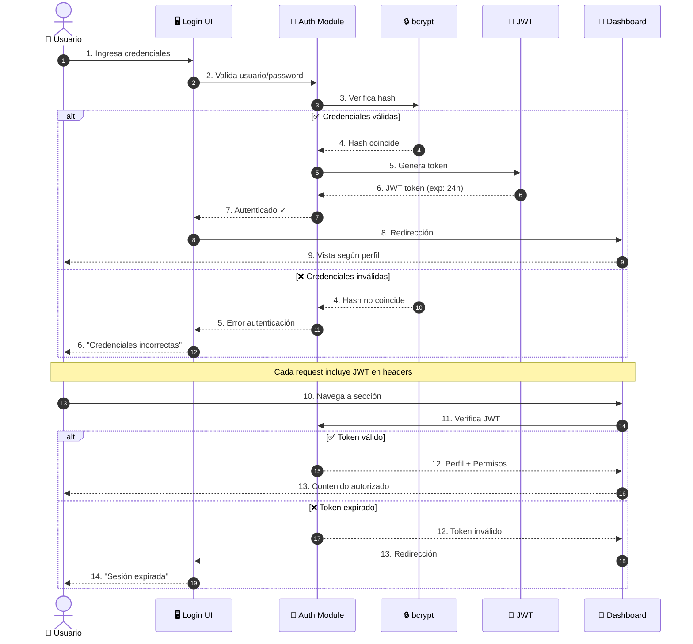
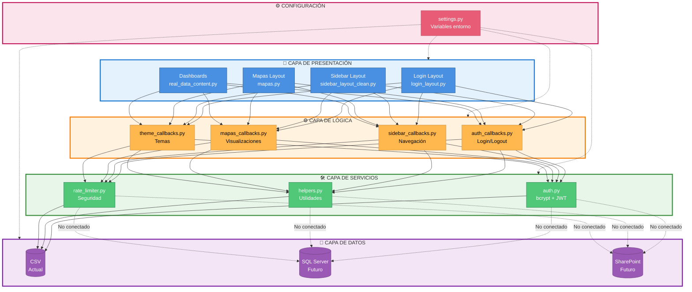
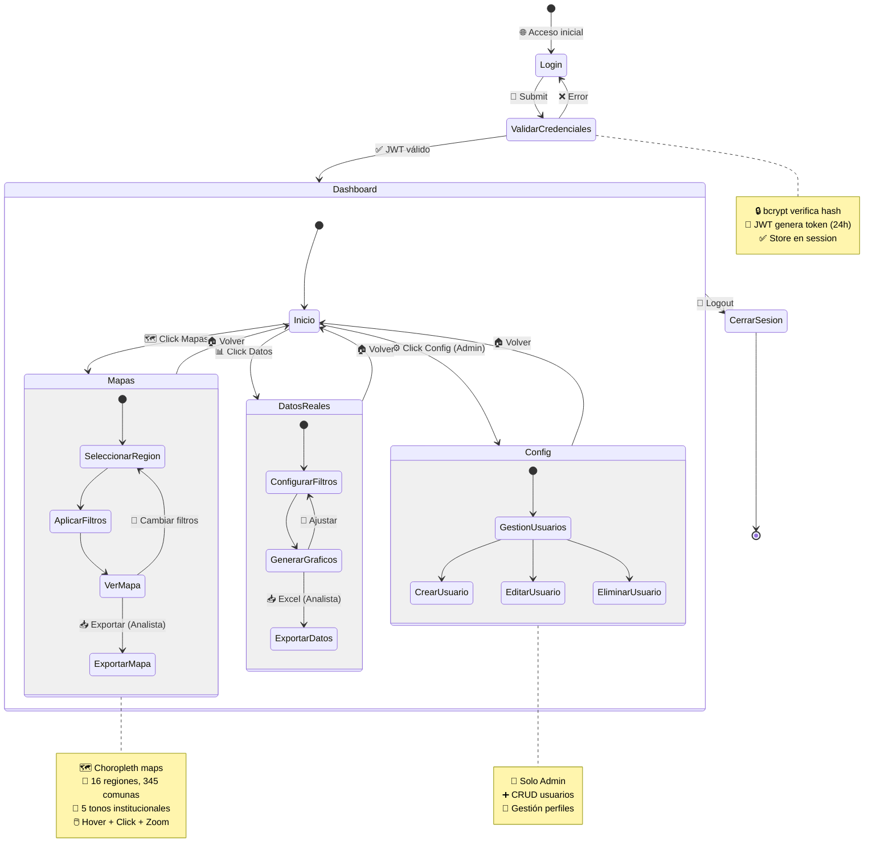
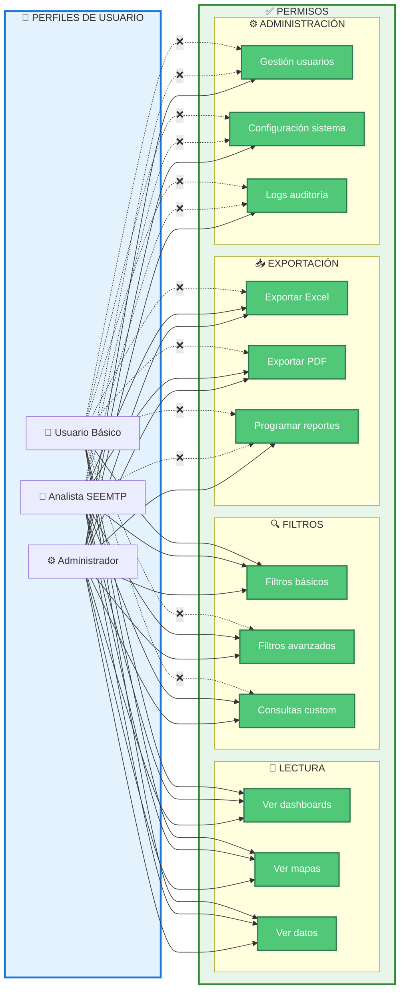
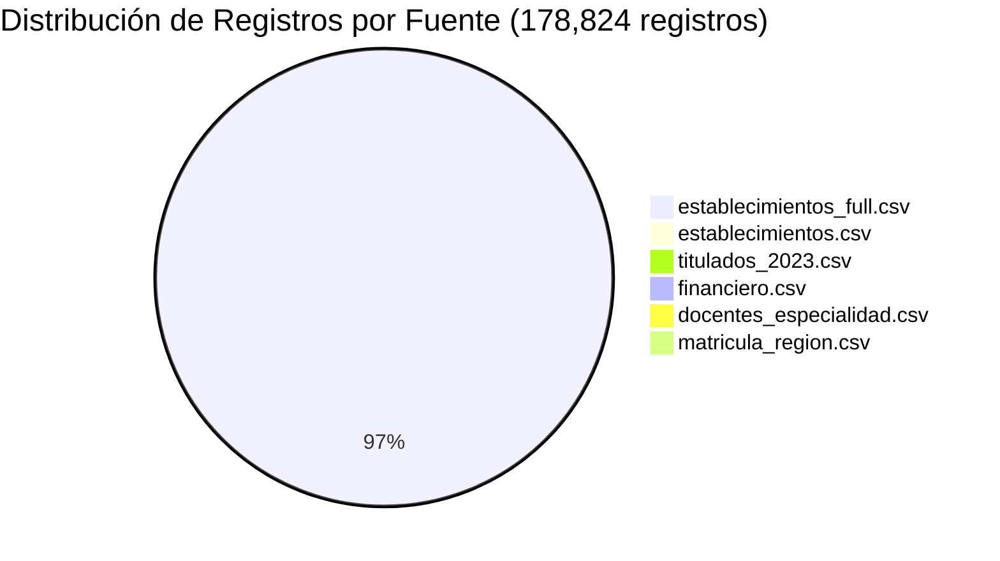
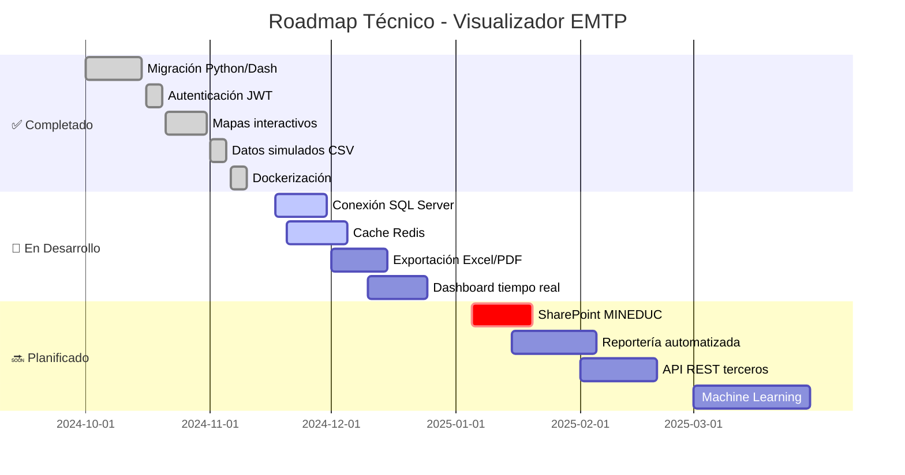

# Diagrama de Flujos - Arquitectura Visualizador EMTP

Este documento contiene diagramas visuales de alta calidad para presentaciones y documentación técnica.

---

## 🎯 Diagrama Principal - Arquitectura de Flujos Completa

```mermaid
graph TB
    %% Definición de nodos principales
    subgraph USUARIOS["👥 USUARIOS"]
        style USUARIOS fill:#E3F2FD,stroke:#1976D2,stroke-width:3px
        U1["👤 Usuario Básico<br/><small>Solo visualización</small>"]
        U2["👔 Analista SEEMTP<br/><small>Análisis + Exportación</small>"]
        U3["⚙️ Administrador<br/><small>Gestión completa</small>"]
    end

    subgraph AUTH["🔐 AUTENTICACIÓN"]
        style AUTH fill:#FFF3E0,stroke:#F57C00,stroke-width:3px
        LOGIN["📝 Login<br/><small>Usuario + Contraseña</small>"]
        BCRYPT["🔒 bcrypt<br/><small>Hash seguro</small>"]
        JWT["🎫 JWT Token<br/><small>Expiración: 24h</small>"]
        VERIFY["✅ Verificación<br/><small>Permisos por perfil</small>"]
    end

    subgraph FRONTEND["🖥️ INTERFAZ DE USUARIO"]
        style FRONTEND fill:#E8F5E9,stroke:#388E3C,stroke-width:3px
        NAV["🧭 Sidebar<br/><small>Navegación principal</small>"]
        MAPAS["🗺️ Mapas Geográficos<br/><small>Regiones y comunas</small>"]
        DASHBOARDS["📊 Dashboards<br/><small>Datos en tiempo real</small>"]
        REPORTES["📄 Reportes<br/><small>Excel/PDF (futuro)</small>"]
    end

    subgraph BACKEND["⚙️ LÓGICA DE NEGOCIO"]
        style BACKEND fill:#FCE4EC,stroke:#C2185B,stroke-width:3px
        CALLBACKS["🔄 Callbacks Dash<br/><small>Reactividad</small>"]
        FILTERS["🔍 Filtros<br/><small>Región, Año, Indicador</small>"]
        PROCESS["⚡ Procesamiento<br/><small>Agregación + Cálculos</small>"]
        PLOTLY["📈 Plotly Engine<br/><small>Visualizaciones</small>"]
    end

    subgraph DATA_ACTUAL["💾 DATOS ACTUALES (CSV)"]
        style DATA_ACTUAL fill:#F3E5F5,stroke:#7B1FA2,stroke-width:3px
        CSV1["📋 establecimientos.csv<br/><small>1,124 registros</small>"]
        CSV2["📋 matricula_region.csv<br/><small>144 registros</small>"]
        CSV3["📋 docentes_especialidad.csv<br/><small>960 registros</small>"]
        CSV4["📋 titulados_2023.csv<br/><small>1,124 registros</small>"]
        CSV5["📋 establecimientos_full.csv<br/><small>174,348 registros</small>"]
    end

    subgraph DATA_FUTURO["🔮 DATOS FUTUROS (Preparado)"]
        style DATA_FUTURO fill:#E0F2F1,stroke:#00796B,stroke-width:3px,stroke-dasharray: 5 5
        SQL1["💿 SQL Server - SIGE<br/><small>Sistema de matrícula</small>"]
        SQL2["💿 SQL Server - Titulados<br/><small>Base titulados</small>"]
        SQL3["💿 SQL Server - Financiero<br/><small>Presupuestos</small>"]
        SP["☁️ SharePoint MINEDUC<br/><small>Documentos Excel</small>"]
    end

    subgraph GEO["🗺️ GEODATOS"]
        style GEO fill:#FFF9C4,stroke:#F57F17,stroke-width:3px
        GEOJSON["🌎 GeoJSON Chile<br/><small>16 regiones<br/>345 comunas</small>"]
    end

    %% Flujo de autenticación
    U1 & U2 & U3 --> LOGIN
    LOGIN --> BCRYPT
    BCRYPT --> JWT
    JWT --> VERIFY
    VERIFY --> NAV

    %% Flujo de navegación
    NAV --> MAPAS
    NAV --> DASHBOARDS
    NAV --> REPORTES

    %% Flujo de datos a callbacks
    MAPAS & DASHBOARDS --> CALLBACKS
    CALLBACKS --> FILTERS
    FILTERS --> PROCESS

    %% Datos actuales
    CSV1 & CSV2 & CSV3 & CSV4 & CSV5 --> PROCESS
    GEOJSON --> PROCESS

    %% Datos futuros (líneas punteadas)
    SQL1 & SQL2 & SQL3 & SP -.->|"No conectado"| PROCESS

    %% Procesamiento a visualización
    PROCESS --> PLOTLY
    PLOTLY --> MAPAS
    PLOTLY --> DASHBOARDS

    %% Ciclo de retroalimentación
    MAPAS --> |"Interacción usuario"| CALLBACKS
    DASHBOARDS --> |"Filtros dinámicos"| CALLBACKS

    %% Estilos de nodos
    classDef userStyle fill:#4A90E2,stroke:#2E5C8A,color:#fff,stroke-width:2px
    classDef authStyle fill:#FFB84D,stroke:#CC8A3D,color:#000,stroke-width:2px
    classDef frontStyle fill:#50C878,stroke:#2E7D52,color:#fff,stroke-width:2px
    classDef backStyle fill:#E85D75,stroke:#B84A5F,color:#fff,stroke-width:2px
    classDef dataStyle fill:#9B59B6,stroke:#6C3E7E,color:#fff,stroke-width:2px
    classDef futureStyle fill:#34D1BF,stroke:#00796B,color:#000,stroke-width:2px,stroke-dasharray: 5 5
    classDef geoStyle fill:#FFD54F,stroke:#F57F17,color:#000,stroke-width:2px

    class U1,U2,U3 userStyle
    class LOGIN,BCRYPT,JWT,VERIFY authStyle
    class NAV,MAPAS,DASHBOARDS,REPORTES frontStyle
    class CALLBACKS,FILTERS,PROCESS,PLOTLY backStyle
    class CSV1,CSV2,CSV3,CSV4,CSV5 dataStyle
    class SQL1,SQL2,SQL3,SP futureStyle
    class GEOJSON geoStyle
```



---

## 🔄 Flujo 1: Autenticación de Usuario (Secuencia)



---

## 📊 Flujo 2: Visualización de Mapas Geográficos

```mermaid
flowchart LR
    %% Entrada del usuario
    START([👤 Usuario<br/>selecciona filtros])
    
    subgraph INPUT["📥 ENTRADA"]
        F1[🗺️ Región<br/><small>16 opciones</small>]
        F2[📅 Año<br/><small>2020-2025</small>]
        F3[📊 Indicador<br/><small>Matrícula/Docentes/etc</small>]
    end
    
    subgraph CALLBACK["🔄 CALLBACK"]
        CB[mapas_callbacks.py<br/>@callback<br/>actualizar_mapa()]
    end
    
    subgraph QUERY["🔍 CONSULTA"]
        SQL[Filtrar datos:<br/>WHERE region = X<br/>AND año = Y]
        AGG[Agrupar:<br/>GROUP BY comuna<br/>SUM/AVG/COUNT]
    end
    
    subgraph MERGE["🔗 FUSIÓN"]
        JOIN[Merge:<br/>datos + GeoJSON<br/>por código comuna]
    end
    
    subgraph DATA["💾 FUENTES"]
        CSV[(CSV Files<br/>178K registros)]
        GEO[(GeoJSON<br/>345 comunas)]
    end
    
    subgraph VIZ["📈 VISUALIZACIÓN"]
        PLOT[Plotly<br/>Choropleth Map]
        COLOR[Escala colores<br/>5 tonos institucionales]
        INTER[Interactividad<br/>Hover + Click + Zoom]
    end
    
    subgraph OUTPUT["📤 SALIDA"]
        MAP[🗺️ Mapa Interactivo<br/>en dashboard]
    end
    
    %% Flujo
    START --> F1 & F2 & F3
    F1 & F2 & F3 --> CB
    CB --> SQL
    SQL --> CSV
    SQL --> AGG
    AGG --> JOIN
    JOIN --> GEO
    GEO --> PLOT
    PLOT --> COLOR
    COLOR --> INTER
    INTER --> MAP
    MAP --> |Usuario interactúa| START
    
    %% Estilos
    style START fill:#4A90E2,stroke:#2E5C8A,color:#fff,stroke-width:3px
    style INPUT fill:#E3F2FD,stroke:#1976D2,stroke-width:2px
    style CALLBACK fill:#FFF3E0,stroke:#F57C00,stroke-width:2px
    style QUERY fill:#FCE4EC,stroke:#C2185B,stroke-width:2px
    style MERGE fill:#F3E5F5,stroke:#7B1FA2,stroke-width:2px
    style DATA fill:#E8F5E9,stroke:#388E3C,stroke-width:2px
    style VIZ fill:#FFF9C4,stroke:#F57F17,stroke-width:2px
    style OUTPUT fill:#E0F2F1,stroke:#00796B,stroke-width:2px
    
    classDef nodeStyle fill:#50C878,stroke:#2E7D52,color:#fff,stroke-width:2px
    class F1,F2,F3,CB,SQL,AGG,JOIN,CSV,GEO,PLOT,COLOR,INTER,MAP nodeStyle
```

---

## 🏗️ Flujo 3: Arquitectura por Capas



---

## 📱 Flujo 4: Estados de Navegación del Usuario



---

## 📋 Permisos por Perfil de Usuario



---

## 📊 Volumen de Datos - Distribución



---

## 🚀 Roadmap de Implementación



---

## 💡 Cómo Usar Estos Diagramas

### Para Presentaciones
1. Copia el código Mermaid
2. Usa herramientas como:
   - **Mermaid Live Editor**: https://mermaid.live
   - **VS Code Extension**: Markdown Preview Mermaid Support
   - **GitHub/GitLab**: Renderiza automáticamente en markdown

### Para Exportar como Imagen
1. Ve a https://mermaid.live
2. Pega el código del diagrama
3. Click en "Actions" → "PNG" o "SVG"
4. Descarga la imagen de alta resolución

### Diagramas Recomendados por Audiencia

| Audiencia | Diagrama Recomendado |
|-----------|---------------------|
| **Jefatura/Directivos** | Diagrama Principal (arquitectura completa) |
| **Equipo TI** | Flujo 3 (Arquitectura por capas) + Flujo 2 (Mapas) |
| **Analistas** | Flujo 4 (Estados navegación) + Permisos por perfil |
| **Desarrolladores** | Flujo 1 (Autenticación) + Flujo 2 (Visualizaciones) |

---

**Creado**: 17 de Noviembre 2025  
**Versión**: 1.0  
**Proyecto**: Visualizador EMTP Dash  
**Desarrollador**: Andrés Lazcano
